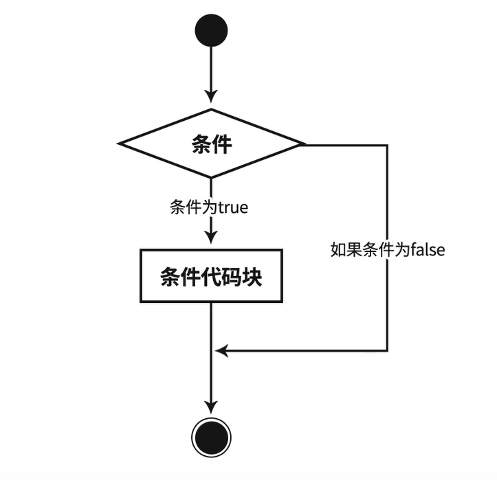

第六课 条件判断
----

* 学习目标

掌握Python里的条件判断语句，熟练使用if-elif-else结构。

* 知识点

    * 缩进

    if下面的代码我们称为代码块或语句块，代码块前面要注意添加缩进，可使用Tab制表符进行输入。

    * 条件判断

    流程图

    

    结构

    if 表达式:
        语句块
    
    if 表达式:
        语句块
    else:
        语句块

    if 表达式:
        语句块
    elif 表达式:
        语句块
    elif 表达式:
        语句块
    else:
        语句块

    * 布尔值

    布尔值分为两种：True和False，True表示正确(真)，False表示错误(假)。

    False可转换为整型，为0值，True为非0值。